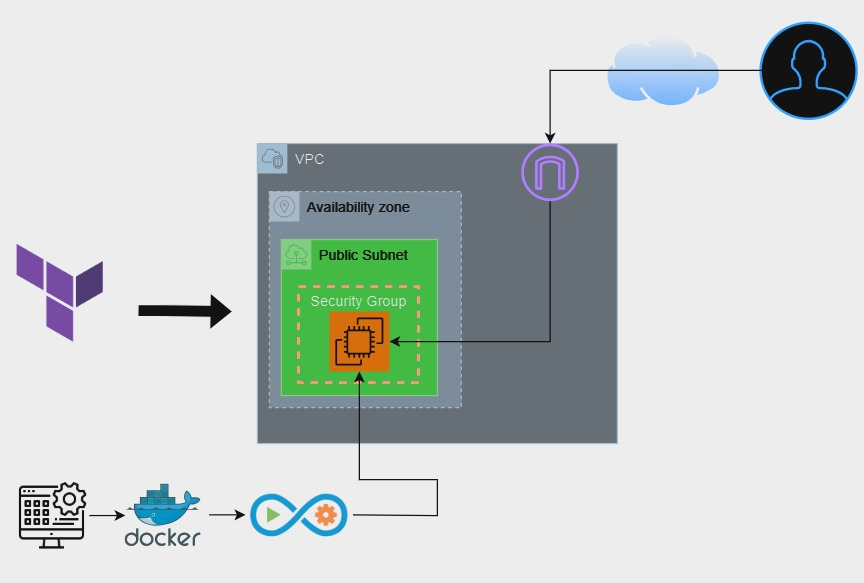

## Introduction
project Terraform for infrastructure provisioning, Ansible for configuration management, Docker for containerization and gitlab CI/CD pipline.

   

# Setting up an S3 bucket to store the Terraform state file (tfstate) involves several steps.
1. Create an S3 Bucket
   - Log in to AWS Console or use the AWS CLI.
   - Create a bucket with a globally unique name.
   - Enable versioning: Versioning ensures that changes to the state file are preserved.
2. Define an S3 Backend in Terraform 
   - Update  Terraform configuration to specify the S3 bucket in `backend.tf` .

## Run the Application**

1. Apply Terraform to create the infrastructure:
   ```bash
   terraform init
   terraform apply
   ```
2. Use Ansible to configure the EC2 instance:
   ```bash
   ansible-playbook -i <EC2-PUBLIC-IP>, playbook.yml
   ```
3. Confirm the application is accessible at `http://<EC2-PUBLIC-IP>:4000`.
